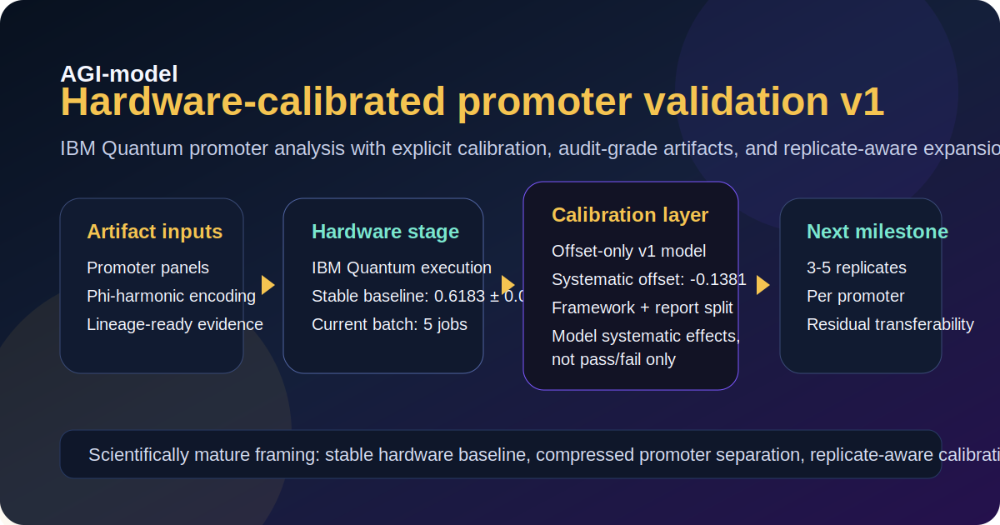
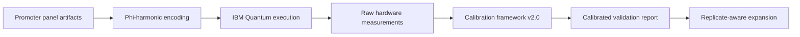

# AGI-model

[](https://codecov.io/gh/quantumdynamics927-dotcom/AGI-model)
[](https://github.com/quantumdynamics927-dotcom/AGI-model/actions/workflows/ci.yml)
[](https://github.com/quantumdynamics927-dotcom/AGI-model/actions/workflows/security.yml)

> **Current stage:** **hardware-calibrated promoter validation v1**  
> The project now treats IBM Quantum hardware deviation as a modelable calibration layer, with replicate-aware expansion as the next required milestone.



AGI-model is an experimental research repository for quantum-inspired modeling, IBM Quantum promoter-panel analysis, audit-grade artifact generation, and TMT-OS-aligned provenance workflows. The latest repository evolution shifts the headline from pass/fail validation to a scientifically stronger question:

**What transformation maps promoter-model predictions to hardware observables?**

## Why this update matters

The recent calibration work is a structural upgrade, not just a better score:

- hardware deviation is now treated as a **systematic empirical effect** instead of an unexplained failure,
- calibration logic is separated from raw execution artifacts and interpreted reports,
- the repository is positioned around **real hardware execution, promoter analysis, and lineage-ready evidence**,
- the next research step is explicit: **replicate-aware promoter calibration**.

## Latest validation snapshot

| Signal | Current reading |
| --- | --- |
| Validation label | Hardware-calibrated promoter validation v1 |
| Calibration model | Offset-only calibration |
| Systematic offset | `-0.1381` |
| Hardware baseline | `0.6183 ± 0.0010` on `ibm_fez` |
| Current batch size | 5 hardware jobs |
| Current interpretation | Promising, but sample-poor |
| Required next milestone | 3-5 replicates per promoter with backend-aware residual analysis |

## Scientific position

### What is supported today

- IBM hardware execution appears **stable and repeatable** for the current promoter batch.
- Promoter separation appears **compressed by hardware execution**, which is scientifically informative.
- The calibration framework is a valid **v1 empirical mapping layer** for this batch.
- Artifact governance now cleanly separates:
  - raw hardware observation,
  - calibration logic,
  - interpreted report output,
  - audit trail.

### What should not be overclaimed

- The **100% post-calibration pass rate is not the headline claim**.
- Five jobs are not enough to establish transferability across promoters or backends.
- The observed baseline near `1/φ` is an interesting observation, not yet a confirmed theory result.

## Calibration workflow



If your Markdown viewer does not render Mermaid diagrams, read the flow as:
promoter artifacts → encoding → IBM hardware execution → raw measurements → calibration layer → calibrated report → replicate-aware expansion.

## Key artifacts from the latest update

| Artifact | Role |
| --- | --- |
| `quantum_calibration_framework.py` | Applies the explicit hardware-calibration layer and validation logic |
| `CALIBRATION_REPORT_v2.0.md` | Human-readable audit report for the current IBM hardware batch |
| `quantum_calibration_report.json` | Machine-readable calibration summary |
| `README_PROMOTER_PANEL.md` | Promoter-panel context and workflow reference |
| `README_TMT_OS_PROMOTERS.md` | TMT-OS promoter integration context |

## Repository focus areas

| Area | Description | Primary entry points |
| --- | --- | --- |
| Hardware-calibrated promoter validation | IBM Quantum execution, phi-resonance measurement, calibration, and reporting | `quantum_calibration_framework.py`, `CALIBRATION_REPORT_v2.0.md`, `agi_scripts/`, `analyze_ibm_hardware_jobs.py` |
| Quantum-inspired modeling | VAE training, latent compression, density-matrix-aware losses | `vae_model.py`, `train_vae.py`, `test_model.py` |
| Analysis and interpretation | Golden-ratio analysis, latent-space inspection, consciousness-oriented metrics | `latent_analysis.py`, `golden_ratio_*.py`, `quantum_consciousness_link.py` |
| TMT-OS and provenance | Interop layers, artifact lineage, audit-oriented utilities | `TMT-OS/`, `packages/`, `integrations/`, `provenance/`, `archive/` |
| Local inspection surfaces | Dashboard and lightweight bridge surfaces | `dashboards/quantum_consciousness_dashboard/`, `main.py`, `index.html` |

## Getting started

### Environment setup

```bash
python -m venv .venv
source .venv/bin/activate
python -m pip install --upgrade pip -r requirements.txt -r requirements-dev.txt
cp .env.example .env
```

### CI-parity test command

```bash
PYTHONPATH="$(pwd):$(pwd)/TMT-OS:$(pwd)/tmt-os-labs" python -m pytest -q
```

### Common workflows

```bash
# Train the VAE
python train_vae.py

# Run a lightweight model check
python test_model.py

# Analyze the latest calibration stage
python quantum_calibration_framework.py

# Explore downstream analysis
python latent_analysis.py
python quantum_consciousness_link.py

# Launch the dashboard
streamlit run dashboards/quantum_consciousness_dashboard/app.py
```

## Replicate-aware next phase

The next milestone is to move from job-level calibration to **replicate-aware promoter calibration**.

For each selected promoter, store:

- promoter ID,
- replicate index,
- backend,
- shots,
- transpiled depth,
- layout,
- measured phi,
- calibrated phi,
- residual,
- execution timestamp.

Then evaluate:

- within-promoter mean and variance,
- between-promoter effect size,
- calibration residual distribution,
- backend-specific offset transferability.

That will determine whether the calibration layer is portable or merely fit to the current five-job batch.

## Documentation

- [Documentation hub](docs/README.md)
- [Architecture guide](docs/architecture/README.md)
- [Development guide](docs/development/README.md)
- [Deployment guide](docs/deployment/README.md)
- [Security guide](docs/security/README.md)
- [Contributing guide](docs/contributing/CONTRIBUTING.md)

## Validation notes

- Local `pytest` currently passes with `PYTHONPATH="$(pwd):$(pwd)/TMT-OS:$(pwd)/tmt-os-labs"`.
- Repository-wide linting currently reports pre-existing failures in legacy/imported subtrees outside this documentation refresh.

## License

This repository is licensed under the [GNU Affero General Public License v3.0](LICENSE).
